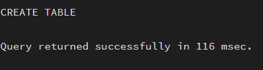
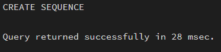
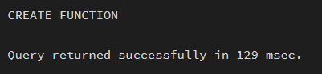
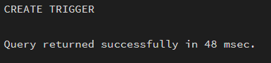
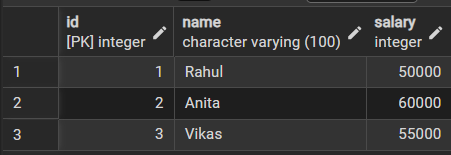

# Experiment 10

## Aim

To design a trigger that automatically implements the functionality of a primary key, ensuring unique identification of records without manual intervention.

---

## Software Requirements

### Database Management System
- PostgreSQL  

### Database Administration Tool
- pgAdmin  

---

## Objective

To create a database trigger that automatically enforces primary key constraints or generates unique key values, replicating the functionality of a stored procedure.

---

## Practical / Experimental Steps

Step 1: Create the required table with a primary key column.  
Step 2: Create a sequence to generate unique key values.  
Step 3: Write a trigger function to assign the sequence value before insertion.  
Step 4: Define a BEFORE INSERT trigger on the table.  
Step 5: Link the trigger to the trigger function.  
Step 6: Insert multiple records without specifying the primary key.  
Step 7: Verify that unique primary keys are generated automatically.  

---

## I / O Analysis

### A) Create Table
```sql
CREATE TABLE employees (
    id INT PRIMARY KEY,
    name VARCHAR(100),
    salary INT
);
```


### B) Create Sequence
```sql
CREATE SEQUENCE emp_seq START 1;
```


### C) Create Trigger Function
```sql
CREATE OR REPLACE FUNCTION assign_emp_id()
RETURNS TRIGGER AS $$
BEGIN
    IF NEW.id IS NULL THEN
        NEW.id := nextval('emp_seq');
    END IF;
    RETURN NEW;
END;
$$ LANGUAGE plpgsql;
```


### D) Create Trigger
```sql
CREATE TRIGGER before_insert_emp
BEFORE INSERT ON employees
FOR EACH ROW
EXECUTE FUNCTION assign_emp_id();
```


### E) Insert Data
```sql
INSERT INTO employees (name, salary) VALUES ('Rahul', 50000);
INSERT INTO employees (name, salary) VALUES ('Anita', 60000);
INSERT INTO employees (name, salary) VALUES ('Vikas', 55000);
```

### F) Output
```sql
SELECT * FROM employees;
```



---

## Learning Outcomes

- Understand the purpose and working of database triggers  
- Implement automated primary key functionality using triggers  
- Ensure data integrity without manual key assignment  
- Apply trigger-based automation in real-world enterprise applications  
