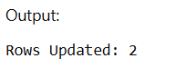
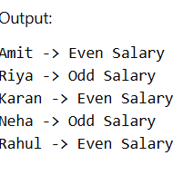

# Experiment 6 – Cursors in PL/SQL

## Aim
To understand the concept and working of cursors in PL/SQL for row-by-row data processing, and to analyze how implicit cursors, explicit cursors, and cursor attributes are used to implement business logic on multiple rows in a database table.

---

## Software Requirements

### Database Management System
- Oracle Database Express Edition (Oracle XE)
- PostgreSQL Database

### Database Administration Tool
- Oracle SQL Developer
- pgAdmin

---

## Objective
- To implement implicit cursors in PL/SQL.
- To implement explicit cursors for row-by-row processing.
- To understand cursor attributes such as %ROWCOUNT, %FOUND, and %NOTFOUND.
- To apply business logic on multiple rows effectively.

---

## I / O Analysis

### Implicit Cursor
```sql
CREATE TABLE Employees (
    employee_id INT PRIMARY KEY,
    name VARCHAR(50),
    salary INT
);

INSERT INTO Employees (employee_id, name, salary) VALUES
(1, 'Amit', 45000),
(2, 'Riya', 52001),
(3, 'Karan', 38000),
(4, 'Neha', 61015),
(5, 'Rahul', 50000);

DECLARE
    v_rows NUMBER;
BEGIN
    UPDATE Employees
    SET salary = salary * 1.10
    WHERE salary < 50000;

    v_rows := SQL%ROWCOUNT;

    DBMS_OUTPUT.PUT_LINE('Rows Updated: ' || v_rows);
END;
/
```



---

### Explicit Cursor
```sql
DECLARE
    CURSOR emp_cursor IS
        SELECT employee_id, name, salary FROM Employees;

    v_id Employees.employee_id%TYPE;
    v_name Employees.name%TYPE;
    v_salary Employees.salary%TYPE;
BEGIN
    OPEN emp_cursor;

    LOOP
        FETCH emp_cursor INTO v_id, v_name, v_salary;
        EXIT WHEN emp_cursor%NOTFOUND;

        IF MOD(v_salary, 2) = 0 THEN
            DBMS_OUTPUT.PUT_LINE(v_name || ' -> Even Salary');
        ELSE
            DBMS_OUTPUT.PUT_LINE(v_name || ' -> Odd Salary');
        END IF;
    END LOOP;

    CLOSE emp_cursor;
END;
/
```



---

## Learning Outcomes
- Understood the concept of cursors in PL/SQL.
- Learned the difference between implicit and explicit cursors.
- Practiced using SQL%ROWCOUNT with implicit cursors.
- Implemented row-by-row processing using explicit cursors.
- Applied conditional logic inside cursor loops.
