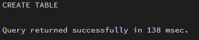
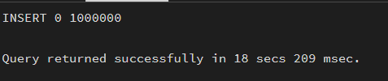
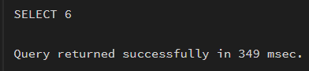

## Aim

To design and implement a materialized view and to compare and analyze
execution time and performance differences between simple views, complex
views, and materialized views, thereby understanding their impact on
query optimization and system performance.

------------------------------------------------------------------------

## Software Requirements

### Database Management System

-   PostgreSQL

### Database Administration Tool

-   pgAdmin

------------------------------------------------------------------------

## Objective

-   To create simple views based on a single table.
-   To create complex views involving joins and aggregation.
-   To create materialized views storing precomputed results.
-   To compare execution time between simple views, complex views, and
    materialized views.
-   To analyze performance improvements in enterprise-level scenarios.

------------------------------------------------------------------------


---

## Practical / Experimental Steps

Step 1: Create base tables (Employee, Department, Payroll).
Step 2: Insert sample data into tables.
Step 3: Create a simple view based on a single table.
Step 4: Create a complex view involving joins and aggregation.
Step 5: Create a materialized view storing precomputed results.
Step 6: Execute queries on all views.
Step 7: Compare execution time and analyze performance.


---

## I / O Analysis

### A) Create Tables

``` sql
-- SandDisk (Product table)
CREATE TABLE sanddisk (
    product_id SERIAL PRIMARY KEY,
    product_name VARCHAR(100),
    category VARCHAR(50),
    price NUMERIC(10,2)
);

-- JTG (Customer table)
CREATE TABLE jtg (
    customer_id SERIAL PRIMARY KEY,
    customer_name VARCHAR(100),
    city VARCHAR(100)
);

-- PayPal (Transaction table)
CREATE TABLE paypal (
    transaction_id SERIAL PRIMARY KEY,
    product_id INT REFERENCES sanddisk(product_id),
    customer_id INT REFERENCES jtg(customer_id),
    quantity INT,
    transaction_date DATE,
    payment_amount NUMERIC(12,2)
);
```

------------------------------------------------------------------------

### B) Insert Sample Data

``` sql
INSERT INTO sanddisk (product_name, category, price)
SELECT 
    'Product_' || i,
    CASE WHEN i % 2 = 0 THEN 'Storage' ELSE 'Accessories' END,
    (RANDOM()*5000)::NUMERIC(10,2)
FROM generate_series(1, 10000) AS s(i);

INSERT INTO jtg (customer_name, city)
SELECT 
    'Customer_' || i,
    CASE WHEN i % 3 = 0 THEN 'Delhi'
         WHEN i % 3 = 1 THEN 'Mumbai'
         ELSE 'Bangalore'
    END
FROM generate_series(1, 20000) AS s(i);

INSERT INTO paypal (product_id, customer_id, quantity, transaction_date, payment_amount)
SELECT 
    (RANDOM()*9999 + 1)::INT,
    (RANDOM()*19999 + 1)::INT,
    (RANDOM()*10 + 1)::INT,
    CURRENT_DATE - (RANDOM()*365)::INT,
    (RANDOM()*10000)::NUMERIC(12,2)
FROM generate_series(1, 1000000);
```

------------------------------------------------------------------------

### C) Create Views

``` sql
CREATE VIEW simple_view AS
SELECT transaction_id, product_id, customer_id, payment_amount
FROM paypal;

CREATE VIEW complex_view AS
SELECT 
    s.category,
    j.city,
    COUNT(p.transaction_id) AS total_transactions,
    SUM(p.payment_amount) AS total_revenue
FROM paypal p
JOIN sanddisk s ON p.product_id = s.product_id
JOIN jtg j ON p.customer_id = j.customer_id
GROUP BY s.category, j.city;

CREATE MATERIALIZED VIEW materialized_sales_summary AS
SELECT 
    s.category,
    j.city,
    COUNT(p.transaction_id) AS total_transactions,
    SUM(p.payment_amount) AS total_revenue
FROM paypal p
JOIN sanddisk s ON p.product_id = s.product_id
JOIN jtg j ON p.customer_id = j.customer_id
GROUP BY s.category, j.city;
```

------------------------------------------------------------------------

### D) Compare Their Performance

``` sql
EXPLAIN ANALYZE SELECT * FROM simple_view WHERE payment_amount > 5000;
```

```sql
EXPLAIN ANALYZE SELECT * FROM complex_view;
```

```sql
EXPLAIN ANALYZE SELECT * FROM materialized_sales_summary;
```


------------------------------------------------------------------------

## Learning Outcomes

-   Understood the concept and working of materialized views.
-   Differentiated between simple views, complex views, and materialized
    views.
-   Learned how materialized views store precomputed results physically.
-   Measured and compared query execution times.
-   Analyzed the performance benefits of materialized views in
    large-scale data systems.
-   Understood enterprise use cases in organizations such as SandDisk,
    JTG, and PayPal.
