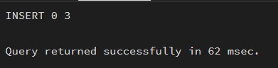
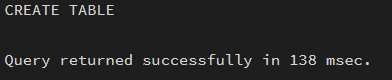
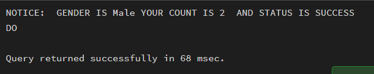
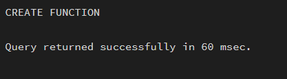

## Aim

To create and execute a stored procedure that retrieves employee data and calculates bonus dynamically using input parameters, demonstrating the use of functions and procedural logic in PostgreSQL.

---

## Software Requirements

### Database Management System
- PostgreSQL  

### Database Administration Tool
- pgAdmin  

---

## Objective

To write and execute a PL/SQL stored procedure that dynamically accepts gender as an argument and computes the employee count corresponding to the given gender.

---

## Practical / Experimental Steps

Step 1: Create the base table `employees` with required attributes.  
Step 2: Insert sample data into the employees table.  
Step 3: Create a stored procedure to calculate employee count based on gender using input parameters.  
Step 4: Implement logic inside the procedure using aggregate functions (COUNT).  
Step 5: Execute the procedure using a DO block with dynamic input values.  
Step 6: Display the output using RAISE NOTICE.  
Step 7: Verify results and analyze correctness of procedure execution.  

---

## I / O Analysis

### A) Create Table
```sql
CREATE TABLE employees (
    emp_id INT PRIMARY KEY,
    emp_name VARCHAR(100) NOT NULL,
    salary NUMERIC(10,2) NOT NULL,
    department VARCHAR(50)
);
```


---

### B) Insert Sample Data
```sql
INSERT INTO employees (emp_id, emp_name, salary, department) VALUES
(1,'Alice', 50000, 'HR'),
(2,'Bob', 60000, 'IT'),
(3,'Charlie', 55000, 'Finance');
```


---

### C) Stored Procedure and Execution
```sql
CREATE OR REPLACE PROCEDURE get_Employee_Count_BY_Gender(
    IN P_GEN VARCHAR(20), 
    OUT COUNT_EMP INT, 
    INOUT STATUS VARCHAR
)
AS
$$
BEGIN
    SELECT COUNT(*) INTO COUNT_EMP 
    FROM EMPLOYEES 
    WHERE GENDER = P_GEN;

    STATUS := 'SUCCESS';
END;
$$ LANGUAGE PLPGSQL;
```

```sql
DO
$$
DECLARE
    GEN VARCHAR(20) := 'Male';
    COUNT_BY_GEN INT;
    STATUS VARCHAR(20) := 'Fail';
BEGIN
    CALL get_Employee_Count_BY_Gender(GEN, COUNT_BY_GEN, STATUS);

    RAISE NOTICE 
    'GENDER IS % YOUR COUNT IS % AND STATUS IS %',
    GEN, COUNT_BY_GEN, STATUS;
END;
$$;
```


---

### D) Function to Retrieve Employee Data
```sql
CREATE OR REPLACE FUNCTION Get_Data()
RETURNS TABLE(name_emp VARCHAR(10), emp_salary NUMERIC(10,2))
AS
$$ 
BEGIN 
    RETURN QUERY 
    SELECT emp_name, salary FROM employees;
END;
$$ LANGUAGE PLPGSQL;
```

```sql
SELECT * FROM Get_Data();
```


---

## Learning Outcomes

- Understood the structure of stored procedures in PostgreSQL  
- Learned implementation of IN, OUT, and INOUT parameters  
- Gained knowledge of passing dynamic inputs to procedures  
- Applied aggregate functions like COUNT within procedures  
- Developed reusable database logic used in real-world applications  
- Understood practical applications in companies like CData and Toddle  
