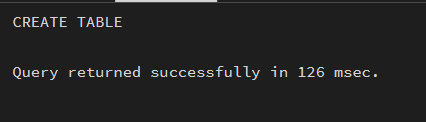
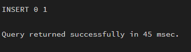
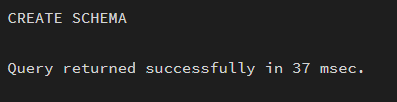
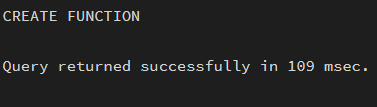
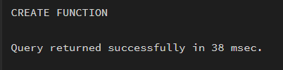
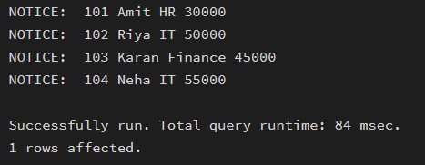
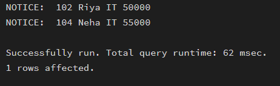

## Aim

To create and implement PL/SQL packages by developing procedures and shared cursors, demonstrating modular, reusable, and efficient database programming using PostgreSQL.

---

## Software Requirements

### Database Management System
- PostgreSQL  

### Database Administration Tool
- pgAdmin  

---

## Objective

To design and implement a package-like structure using schemas and functions in PostgreSQL that includes procedures and shared cursor logic for structured and modular program development.

---


## Practical / Experimental Steps

Step 1: Create the base table `employee` with attributes such as emp_id, emp_name, department, and salary.  
Step 2: Insert sample data into the employee table.  
Step 3: Create a schema (`emp_package`) to simulate package behavior.  
Step 4: Develop functions to fetch and display all employee records.  
Step 5: Implement filtering logic using parameters (e.g., department-wise retrieval).  
Step 6: Use cursor-based iteration or loop constructs to process records.  
Step 7: Execute functions and verify output for correctness and modularity.  

---

## I / O Analysis

### A) Create Table
```sql
CREATE TABLE employee (
    emp_id INTEGER PRIMARY KEY,
    emp_name VARCHAR(50),
    department VARCHAR(50),
    salary NUMERIC
);
```


---

### B) Insert Sample Data
```sql
INSERT INTO employee VALUES (101, 'Amit', 'HR', 30000);
INSERT INTO employee VALUES (102, 'Riya', 'IT', 50000);
INSERT INTO employee VALUES (103, 'Karan', 'Finance', 45000);
INSERT INTO employee VALUES (104, 'Neha', 'IT', 55000);
```


---

### C) Create Schema (Package Simulation)
```sql
CREATE SCHEMA emp_package;
```


---

### D) Function to Display All Employees
```sql
CREATE OR REPLACE FUNCTION emp_package.get_all_employees()
RETURNS VOID AS $$
DECLARE
    emp_rec RECORD;
BEGIN
    FOR emp_rec IN SELECT * FROM employee LOOP
        RAISE NOTICE '% % % %',
            emp_rec.emp_id,
            emp_rec.emp_name,
            emp_rec.department,
            emp_rec.salary;
    END LOOP;
END;
$$ LANGUAGE plpgsql;
```


---

### E) Function to Filter by Department
```sql
CREATE OR REPLACE FUNCTION emp_package.get_emp_by_dept(p_dept VARCHAR)
RETURNS VOID AS $$
DECLARE
    emp_rec RECORD;
BEGIN
    FOR emp_rec IN SELECT * FROM employee LOOP
        IF emp_rec.department = p_dept THEN
            RAISE NOTICE '% % % %',
                emp_rec.emp_id,
                emp_rec.emp_name,
                emp_rec.department,
                emp_rec.salary;
        END IF;
    END LOOP;
END;
$$ LANGUAGE plpgsql;
```


---

### F) Execution
```sql
SELECT emp_package.get_all_employees();
```


```sql
SELECT emp_package.get_emp_by_dept('IT');
```



---

## Learning Outcomes

- Understood the concept of PL/SQL packages and their structure  
- Learned how to simulate packages in PostgreSQL using schemas  
- Implemented functions with cursor-like iteration  
- Developed modular and reusable database logic  
- Gained knowledge of parameterized functions for filtering data  
- Understood real-world application of modular database programming  
- Applied concepts used in enterprise systems like Oracle, SAP, and PayPal  
